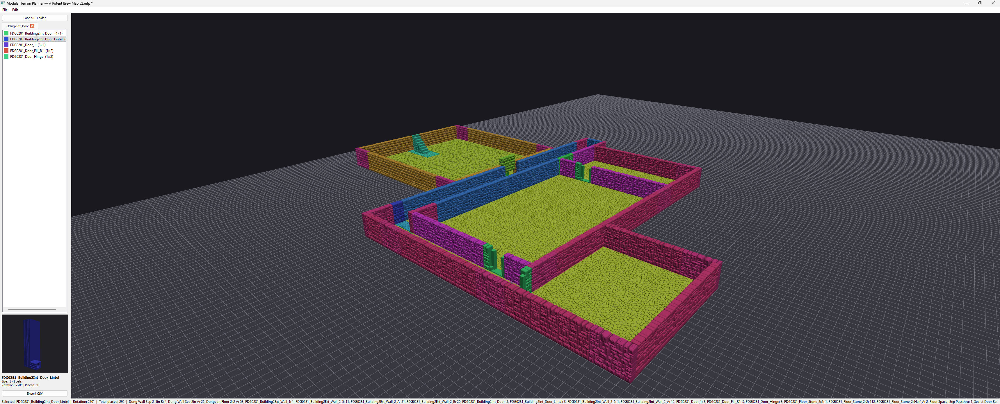

# D&D STL Dungeon Designer

A desktop tool for designing tabletop RPG dungeon layouts by placing modular terrain STL tiles on a grid — like digital Lego. When you're done, export a print list as CSV so you know exactly how many of each tile to print.

  



---

## Features

- **3D dungeon view** — Full OpenGL 3.3 rendering with flat shading and three-point lighting
- **Interactive orbit camera** — Rotate, pan, and zoom around the dungeon layout
- **Tile model previewer** — 3D preview of the selected tile in the palette; orbit and zoom independently
- **Multi-folder tabs** — Load multiple STL folders as separate tabs and switch between them instantly
- **Auto-detect tile size** — Reads bounding boxes from STL files and maps them to grid cells (1 cell = 25 mm)
- **Snap-to-grid placement** — Left-click to place, right-click to remove; pending tile centers on cursor
- **Ghost preview** — Hover to see where a tile will land before placing it
- **Tile rotation** — Press R to rotate the pending tile 90°; rotation pivots around the cursor
- **Select & move** — When no tile is selected in the palette, left-click/drag to select placed tiles and reposition them; Shift-click to add to the selection; drag a box over empty space for rubber-band multi-select
- **Battle map overlay** — Load any image (PNG/JPG/BMP) as a ground-plane texture; position and scale it to match the grid
- **Print list export** — Export tile counts to CSV for your slicer/print queue
- **Inches heuristic** — Automatically detects and converts inch-unit STL files (e.g. OpenForge tiles)

---

## Requirements

- Python 3.9 or newer
- Windows (tested), should work on Linux/macOS with minor path adjustments

Dependencies are installed automatically by `launch.bat`:

```
PyQt5 >= 5.15
numpy-stl >= 3.0
numpy >= 1.24
PyOpenGL >= 3.1
```

---

## Getting Started

### Windows (recommended)

Double-click **`launch.bat`**. It will:
1. Create a `.venv` virtual environment if one doesn't exist
2. Install all dependencies into it
3. Launch the application

### Manual

```bash
python -m venv .venv
.venv\Scripts\activate        # Windows
# source .venv/bin/activate   # Linux/macOS
pip install -r requirements.txt
python main.py
```

---

## Usage

1. **Load STL folder** — Click *Load STL Folder* in the palette panel and select a directory containing `.stl` files. Each folder opens as a new tab. Load as many folders as you like and switch between them instantly.
2. **Select a tile** — Click a tile in the list. A 3D preview appears below the list; left-drag the preview to orbit it, scroll to zoom.
3. **Place tiles** — Move your mouse over the grid and left-click to place. The ghost preview shows where the tile will land.
4. **Rotate** — Press **R** to rotate the pending tile 90° clockwise. The palette preview updates to match.
5. **Remove** — Right-click a placed tile to remove it.
6. **Select & move placed tiles** — Press **Esc** to deselect any palette tile, then:
   - **Left-click** a tile to select it (highlighted in blue); click elsewhere to deselect.
   - **Shift + left-click** to add or remove tiles from the selection.
   - **Left-drag over empty space** to draw a rubber-band box and select all tiles inside it.
   - **Left-drag a selected tile** to move the entire selection (snaps to grid; hold **Ctrl** for free placement).
   - **R** while dragging rotates the group around its centroid.
   - **Esc** clears the selection.
7. **Copy & paste** — With tiles selected:
   - **Ctrl+C** copies the selection.
   - **Ctrl+V** enters paste ghost mode — semi-transparent ghost tiles follow the cursor. Left-click to place a copy (paste mode stays active for repeated placements). **Esc** exits paste mode.
8. **Navigate the main camera**:
   - **Right-drag** — Orbit (azimuth / elevation)
   - **Middle-drag** — Pan
   - **Scroll wheel** — Zoom in / out
   - **Home** — Reset camera to default position
9. **Manage folders** — Click the × on a tab to unload that folder. Tiles already placed on the grid remain.
10. **Battle map overlay** — Go to *Edit → Set Ground Image…*, pick an image file, then set its X/Y offset and width/height in grid cells so it lines up with your tile grid. Use *Edit → Clear Ground Image* to remove it.
11. **Export** — Click *Export CSV* to save a print list with tile names and quantities.

---

## Project Structure

```
.
├── main.py                  # Entry point, sets up OpenGL surface format
├── launch.bat               # Windows launcher (venv + dependency bootstrap)
├── requirements.txt
├── models/
│   ├── tile_definition.py   # TileDefinition dataclass (name, size, mesh data)
│   ├── placed_tile.py       # PlacedTile (definition + grid position + rotation)
│   └── grid_model.py        # Grid state: placement, collision, counts
├── stl_loader/
│   └── loader.py            # STL parsing, bounding-box sizing, voxel decimation
├── gui/
│   ├── main_window.py         # QMainWindow shell, wires palette ↔ grid view
│   ├── gl_grid_view.py        # QOpenGLWidget: 3D scene, orbit camera, ray-casting
│   ├── tile_preview_widget.py # QOpenGLWidget: isolated 3D preview of selected tile
│   ├── palette_panel.py       # Left panel: folder tabs, tile list, preview, export
│   └── gl_helpers.py          # Shared GLSL shaders + GPU geometry utilities
└── export/
    └── csv_exporter.py      # CSV print-list export
```

---

## Mesh Processing

STL files for tabletop terrain often contain 100 000–450 000 triangles. The loader applies **voxel-clustering decimation** before uploading to the GPU:

1. The full mesh is loaded via `numpy-stl`
2. Triangle centroids are quantised to a 100×100×100 spatial grid
3. One representative triangle is kept per occupied cell
4. This yields ~30 000–65 000 connected triangles — visually complete, GPU-friendly

Flat per-face normals are computed from the cross product of each triangle's edges, so shading works correctly regardless of the normals stored in the STL file.

---

## License

MIT
